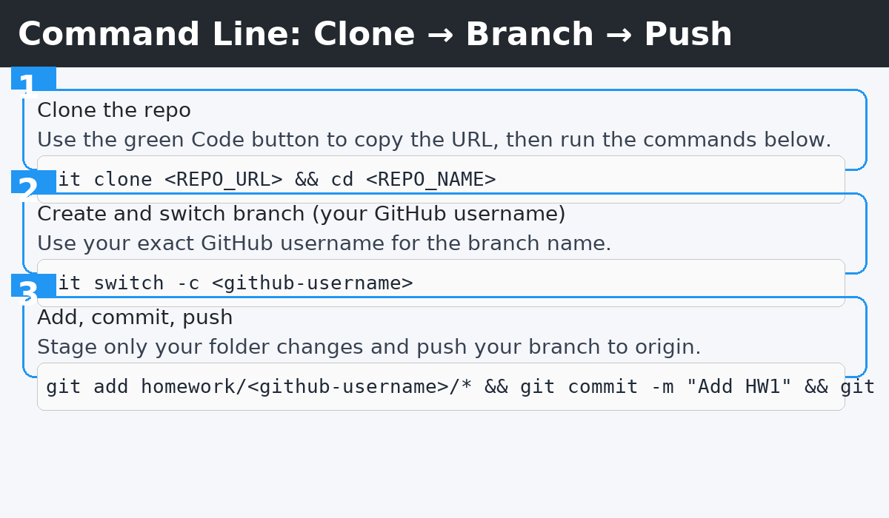
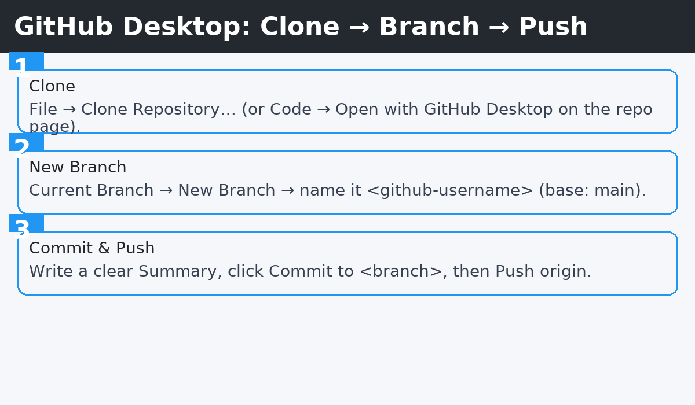
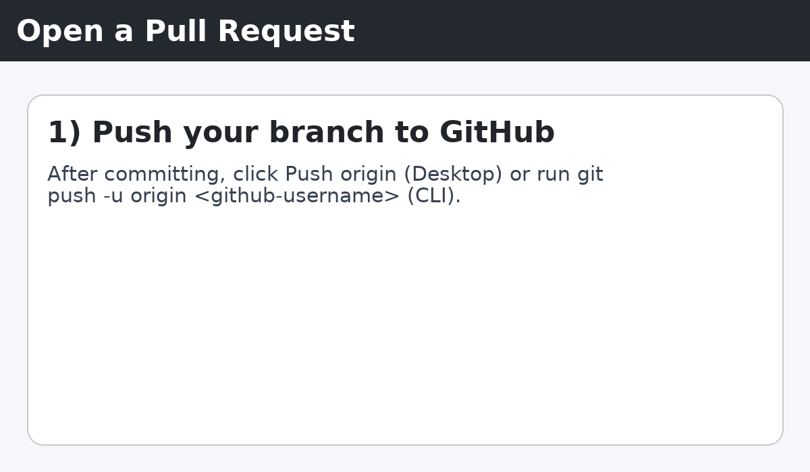
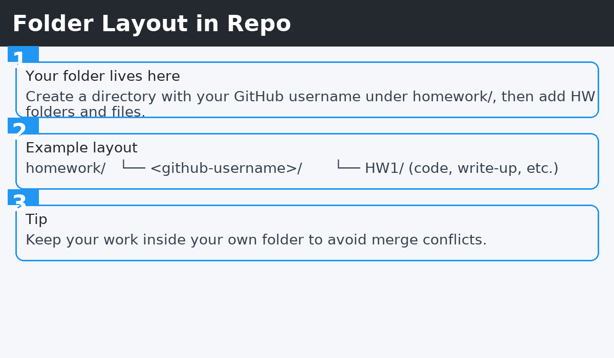

# BIOL-GA-1133

This is the repo for Machine Learning in Medicine and Biology.

# Homework Workflow (Clone → Branch → Submit)

Use either **Command Line** or **GitHub Desktop**. Follow all three stages: **Cloning → Branching → Submitting**. Your branch name must be **your GitHub username** (e.g., `octocat`).

> 📁 Put your work in: `homework/<github-username>/HW#` (for example, `homework/alex-lee/HW1`).

---

## Option A — Command Line



### 1) Cloning
```bash
git clone <REPO_URL>
cd <REPO_NAME>
```
For reference, see GitHub’s docs on cloning and pushing. [GitHub Docs — Cloning a repository](https://docs.github.com/en/repositories/creating-and-managing-repositories/cloning-a-repository)

### 2) Branching
Create **and switch to** a branch named exactly your GitHub username:
```bash
git switch -c <github-username>
# If your Git is older: git checkout -b <github-username>
```

Create your personal folder and add your files:
```
homework/
└── <github-username>/
    └── HW1/
```

### 3) Submitting (add → commit → push → pull request)
```bash
git add homework/<github-username>/**
git commit -m "Add HW1 in homework/<github-username>/"
git push -u origin <github-username>
```
Then open the repository on GitHub and **Create a Pull Request** from `<github-username>` **into** `main`.

---

## Option B — GitHub Desktop



### 1) Cloning
- **File → Clone Repository…** (or on GitHub, **Code → Open with GitHub Desktop**).

### 2) Branching
- **Current Branch → New Branch** → name it **`<github-username>`**, base it on **`main`** → **Create Branch**.

### 3) Submitting (commit → push → pull request)
1. Write a short **Summary** (commit message) → **Commit to `<github-username>`**.
2. **Push origin** to publish the branch.
3. Click **Compare & pull request**/**Create Pull Request**, ensure **base: `main`** and **compare: `<github-username>`**, then **Create pull request**.

**Animated guide:**


---

## Folder Layout & Naming Rules



- **Branch name:** your exact **GitHub username** (no spaces).
- **Folder:** `homework/<github-username>/HW#` (e.g., `homework/kamalasaurus/HW1`).
- **Commit message:** short & informative (e.g., `Add HW1 (logistic regression)`).
- **PR target:** **into `main`** from **`<github-username>`**.

---

## Troubleshooting

- **“I don’t see my branch on GitHub.”** You probably didn’t push yet. Run `git push -u origin <github-username>` (CLI) or click **Push origin** (Desktop). [GitHub Docs — Pushing commits to a remote](https://
 docs.github.com/en/get-started/using-git/pushing-commits-to-a-remote-repository)
- **“Desktop can’t find the repo.”** Use **File → Clone Repository…** in GitHub Desktop or **Code → Open with GitHub Desktop** on the repo page. [GitHub Docs — Cloning a repository](https://docs.github.com/
 en/repositories/creating-and-managing-repositories/cloning-a-repository)
- **“Which command creates and switches to a new branch?”** `git switch -c <github-username>` (or `git checkout -b <github-username>` on older Git).

---

### References
- GitHub Docs — Cloning a repository [GitHub Docs — Cloning a repository](https://docs.github.com/en/repositories/creating-and-managing-repositories/cloning-a-repository)
- GitHub Docs — Pushing commits to a remote [GitHub Docs — Pushing commits to a remote](https://docs.github.com/en/get-started/using-git/pushing-commits-to-a-remote-repository)
- GitHub Docs — Creating a pull request [GitHub Docs — Creating a pull request](https://docs.github.com/en/pull-requests/collaborating-with-pull-requests/proposing-changes-to-your-work-with-pull-requests/creating-a-pull-request)
- GitHub Docs — Managing branches in GitHub Desktop [GitHub Desktop — Managing branches in GitHub Desktop](https://docs.github.com/en/desktop/making-changes-in-a-branch/managing-branches-in-github-desktop)
- GitHub Docs — Cloning to GitHub Desktop [GitHub Desktop — Cloning a repository from GitHub to GitHub Desktop](https://docs.github.com/en/desktop/adding-and-cloning-repositories/cloning-a-repository-from-github-to-github-desktop)
