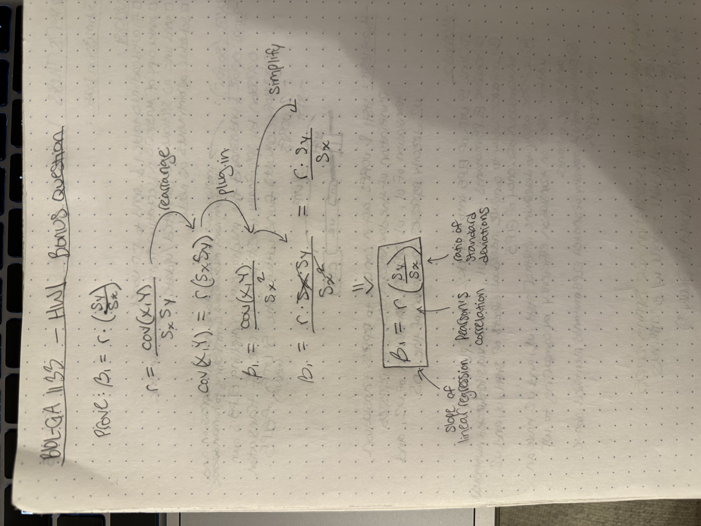

# Homework 1
## Violet Park

### Some informative viewing
I highly recommend watching this series by 3blue1brown to get a sense of what matrix operations are from a vector space perspective and how to visualize them: [Essence of Linear Algebra](https://www.youtube.com/playlist?list=PLZHQObOWTQDPD3MizzM2xVFitgF8hE_ab) .  So far, we will cover the first 4 videos in the series, the rest are enrichment ...or review if you've already done statistics.  We might cover topics like convolution and polynomial multiplication when we get to deep learning, which are a bit different from the vector representation of matrices.  The foundation you build here will be helpful then.

### Matrix Multiplication (2.5pts)

You are a linear algebra expert from Youtube university and have been hired by a local space cadet to help them navigate some vector spaces. They have provided you with the following matrices:

```{r}
A <- matrix(c(1, 2, 3, 4, 5, 6), nrow = 2, byrow = TRUE)
B <- matrix(c(7, 8, 9, 10, 11, 12), nrow = 3, byrow = TRUE)

print(A)
print(B)
```

1. Compute the matrix product \(C = AB\). What are the dimensions of \(C\)? (0.5pts)

```{r}
# performing matrix multiplication and printing the dimensions of the matrix product
C <- A %*% B
print(C)
print(dim(C))
```
The dimensions of C are 2x2.

2. Compute the outer product of the first column of \(A\) with the first row of \(B\). What is the result? (0.5pts)

```{r}
# specifying the first column of A and the first row of B
a <- A[,1]
b <- B[1,]

# using the outer function to compute the outer product
outer_product <- outer(a,b)
print(outer_product)
```

3. Verify that the matrix product \(C\) can be expressed as a sum of outer products of the columns of \(A\) and the rows of \(B\). (0.5pts)

```{r}
# sum of outer products of columns of A and rows of B
C_as_sum <- outer(A[,1], B[1,]) + outer(A[,2], B[2,]) + outer(A[,3], B[3,])
print(C_as_sum)
```

4. Explain in your own words the relationship between matrix multiplication and outer products. (0.5pts)
Matrix multiplication and outer products are related because a matrix multiplication product can be expressed equally as a sum of the outer products of the columns of the first matrix and the rows of the second matrix. The outer products capture the contribution of each column-row pair to the overall matrix product, and summing these outer products gives the same final result of the matrix multiplication. Overall, matrix multiplication is a way to combine linear transformations represented by matrices, while outer products represent the interaction between individual vectors.

5. Implement a function that takes two matrices as input and returns their product using the outer product method. (0.5pts)

```{r}
# looping through columns of the first matrix and rows of the second to compute
# the matrix product using outer products
matrix_multiply_outer <- function(A, B) {
  product <- matrix(0, nrow = nrow(A), ncol = ncol(B))
  for (i in 1:ncol(A)) {
    product <- product + outer(A[,i], B[i,])
  }
  print(product)
}
```

```{r}
# applying the function to matrices A and B to verify it works
matrix_multiply_outer(A, B)
```

### Chick-Weight (7.5pts)
You are a farmer named Bob and your chickens are getting too fat.  Analyze the ChickWeight dataset in R before your chickens get taken away by the ASPCA. Your task is to explore the relationship between diet and weight gain over time in chicks. Perform the following analyses:

Load the ChickWeight dataset and display its structure.  If it's not already included, you can load the attached chick_weight.csv

```{r}
library(ggplot2)
library(ggcorrplot)
library(dplyr)

data("ChickWeight")
str(ChickWeight)
head(ChickWeight)

# If you need to load from a CSV file, uncomment the line below
# ChickWeight <- read.csv("chick_weight.csv")

print(sum(is.na(ChickWeight)))
```

1. Create a summary table showing the average weight of chicks for each diet at each time point. (0.5pts)

```{r}
# using dplyr to group by Diet and Time, then summarize mean weight and
# standard error to be used for the error bars in the next plot
summary_table <- ChickWeight %>%
  group_by(Diet, Time) %>%
  summarize(mean_weight = mean(weight), se = sd(weight)/sqrt(n()), n = n(), .groups = "drop") %>%
  arrange(Diet, Time)
print(summary_table)
```

2. Visualize the weight gain over time for each diet using a line plot with error bars representing the standard error of the mean using ggplot. (0.5pts)

```{r}
# using summary table to create the plot with ggplot2
# coloring the different diets with different colors
plot <- ggplot(summary_table, aes(x = Time, y = mean_weight, color = Diet)) +
  geom_line() +
  geom_point() +
  geom_errorbar(aes(ymin = mean_weight - se, ymax = mean_weight + se, width = 0.2)) +
  labs(title = "Weight Gain Over Time by Diet", x = "Time (days)", y = "Mean Weight (g)") +
  theme_minimal()
print(plot)
```

3. Use the ggcorrplot package to create a correlation heatmap of the numeric variables in the dataset.  Convert the diet column to dummy variables (columns) and include them in the correlation analysis. (1pts)

```{r}
# using dummies of the raw data
# creating the dummy variables for Diet so that each diet has its own column
# with encoded 1s and 0s for presence/absence of that diet
diet1 <- ifelse(ChickWeight$Diet == 1, 1, 0)
diet2 <- ifelse(ChickWeight$Diet == 2, 1, 0)
diet3 <- ifelse(ChickWeight$Diet == 3, 1, 0)
diet4 <- ifelse(ChickWeight$Diet == 4, 1, 0)

# creating a new data frame with the dummy variables included
df_with_dummies <- data.frame(
  weight = ChickWeight$weight,
  Time = ChickWeight$Time,
  diet1 = diet1,
  diet2 = diet2,
  diet3 = diet3,
  diet4 = diet4
)
head(df_with_dummies)

# calculating the correlation matrix and plotting it with ggcorrplot
cor_matrix <- cor(df_with_dummies)

heatmap <- ggcorrplot(cor_matrix, 
                      title = "Correlation Heatmap of ChickWeight Variables",
                      lab = TRUE)
print(heatmap)
```

4.  Calculate a slope coefficient for each diet and time combination using a custom function.  HINT:  use the lm() function inside calculate slope and add 0+ in the front of the independent variables to get slopes for all but no intercepts, otherwise the lm function will drop one of the diet columns to avoid collinearity. (1pts)

```{r}
# function to calculate slope coefficients for each diet and time combination
# since we want each diet and time combination, we use the interaction operator
# ":" to get the slopes for each combination
calculate_slope <- function(data) {
  model <- lm(weight ~ 0+ Diet:Time, data = data)
  return(coef(model))
}

slopes <- calculate_slope(ChickWeight)
print(slopes)
```

5.  Write a function that calculates residual sum of squares (RSS), and then compare the minimal value to find the optimal slopes for each parameter and parameter combination. (1pts)

```{r}
# minimum RSS value from model will imply best slope

# function to calculate RSS for a given linear model and dataset
calculate_rss <- function(model, data) {
  predictions <- predict(model)
  residuals <- data$weight - predictions
  rss <- sum(residuals^2)
  return(rss)
}
```

# You can loop through different models and calculate RSS for each
# to find the optimal slopes for each parameter and parameter combination.
# You can work through it manually as well
```{r}
# working through manually for different models
# comparing each possible combination of parameters, along with Time and Diet
# alone

# for each potential model, running lm() with 0+ to get all slopes
# and calculating RSS using my custom function
model1 <- lm(weight ~ 0+ Time, data = ChickWeight)
rss1 <- calculate_rss(model1, ChickWeight)

model2 <- lm(weight ~ 0+ Diet, data = ChickWeight)
rss2 <- calculate_rss(model2, ChickWeight)

model3 <- lm(weight ~ 0+ Diet + Time, data = ChickWeight)
rss3 <- calculate_rss(model3, ChickWeight)

model4 <- lm(weight ~ 0+ Diet*Time, data = ChickWeight)
rss4 <- calculate_rss(model4, ChickWeight)

model5 <- lm(weight ~ 0+ Diet:Time, data = ChickWeight)
rss5 <- calculate_rss(model5, ChickWeight)

# creating a data frame to compare the RSS values for each model
rss_values <- data.frame(
  Model = c("Time", "Diet", "Diet + Time", "Diet*Time", "Diet:Time"),
  RSS = c(rss1, rss2, rss3, rss4, rss5)
)
print(rss_values)

# finding the model with the minimum RSS value
minimum_rss <- min(rss_values$RSS)
print(rss_values$Model[rss_values$RSS == minimum_rss])
print(minimum_rss)
```
It appears as though the interaction model (Diet*Time) has the lowest RSS value of 661532.0, which means it is the best fit among the models tested.

6.  Use anova to compare the RSS to see if they're significant -- compare the F statistic.  Use the built in anova function.  (0.5pts)

```{r}
# using the anova function to compare all of the models created above
anova_results <- anova(model1, model2, model3, model4, model5)
print(anova_results)
```
Higher F values and lower p-values indicate more significant models. Model 3 (Diet + Time) appears to demonstrate the highest F value and one of the lowest p-values, indicating that it is the most significant models among those tested. However, all models show significance with p-values < 0.05.

7. Fit a linear model to assess the effect of diet and time on weight.  Use backwards selection to find the best model just against the p-values of the coefficients.  Use the same approach with the 0 + leading the independent variables to ensure all lines are present. (1pts)

```{r}
# creating the full model with all diet and time combinations
# i am using the dummy variables created earlier because this allows me to
# better specify the model so that I can infer starting weights for each diet
# (dietx) as well as the weight gain per day for each diet (dietx:Time)
full_model <- lm(weight ~ 0+ diet1 + diet2 + diet3 + diet4 +
                   diet1:Time + diet2:Time + diet3:Time + diet4:Time,
                 data = df_with_dummies)
print(summary(full_model))

# using the step function to perform backwards selection
# this will iteratively remove the least significant variable until all
# remaining variables are significant
final_model <- step(full_model, direction = "backward")
print(summary(final_model))
```
Since the final model produced by the step function is the same as the full model, it appears that all variables are significant and should be retained in the model.

8. Iteratively enhance with backwards selection.  When the F statistic becomes insignificant, stop.  Do not use the step function, implement your own F test based backwards selection. (1pts)

```{r}
# function to manually perform backwards selection based on F-test p-values
f_test_backward_selection <- function(model, alpha = 0.05) {
  current_model <- model
  
  # looping until no more variables can be removed without losing significance
  repeat {
    coefficients <- summary(current_model)$coefficients
    coefs <- rownames(coefficients)
    
    if (length(coefs) <= 1) {
      break
    }
    
    best_p_value <- 0
    worst_coef <- NULL
    
    # testing each coefficient by removing it and comparing the reduced model
    # to the current model using an F-test
    for (name in coefs) {
      all_other_coefs <- coefs[coefs != name]
      reduced_formula <- as.formula(paste("weight ~ 0 +", paste(all_other_coefs, collapse = " + ")))
      reduced_model <- lm(reduced_formula, data = df_with_dummies)
      
      f_test <- anova(reduced_model, current_model)
      p_value <- f_test$`Pr(>F)`[2]
      
      # keeping track of the coefficient with the highest p-value to remove
      if (!is.na(p_value) && p_value > best_p_value) {
        best_p_value <- p_value
        worst_coef <- name
      }
    }
    
    # if the highest p-value is greater than alpha, remove that coefficient
    # and continue the process of running the F-test on the reduced model
    if (p_value > alpha) {
      all_other_coefs <- all_other_coefs[all_other_coefs != name]
      new_model_formula <- as.formula(paste("weight ~ 0 +", paste(all_other_coefs, collapse = " + ")))
      current_model <- lm(new_model_formula, data = df_with_dummies)
      print(paste("Removed:", worst_coef, "(p =", best_p_value), ")")
      return(f_test_backward_selection(model, alpha))
    } else {
      # if no coefficients can be removed without losing significance, stop
      print("No more coefficients can be removed without significance loss.")
      break
    }
  }

  return(model)
}

# applying the function to the full model, where the final model will be
# printed along with the coefficients that were removed (if any)
best_model <- f_test_backward_selection(final_model)
print(summary(best_model))
```
Similarly to the previous question, the final model produced by the custom backwards selection function here is the same as the final (and initial) model from before, indicating that all variables are significant and should be retained in the model. No coefficients were removed during the process. I tried altering the alpha value to see if any coefficients would be removed, but even with a very stringent alpha of 0.001, no coefficients were removed. This implies that all variables in the model are highly significant.

9. Create a quadratic line with just weight vs time (quadratic vs linear) -- calculate RSS with results from quadratic to see if it's better. (0.5pts)

```{r}
# creating a quadratic model with weight as a function of time, where the
# quadratic term is specified using I(Time^2)
quadratic_model <- lm(weight ~ 0+ Time + I(Time^2), data = ChickWeight)
print(summary(quadratic_model))

# also creating a linear model for comparison
linear_model <- lm(weight ~ 0+ Time, data = ChickWeight)
print(summary(linear_model))

# calculating RSS for the quadratic model using the custom function
rss_quadratic <- calculate_rss(quadratic_model, ChickWeight)
print(rss_quadratic)

# calculating RSS for the linear model using the custom function
rss_linear <- calculate_rss(linera_model, ChickWeight)
print(rss_linear)
```
It appears that when considering a model with just Time as a predictor, the quadratic model has a lower RSS value (979262.4) compared to the linear model (996120.2), indicating that the quadratic model fits the data better in this case with fewer predictors.

10.  Generate a null model of chick-weight to hypothetically use for forwards selection. (0.5pts)

```{r}
# null model with just the intercept (specified by 1)
null_model <- lm(weight ~ 1, data = ChickWeight)
print(summary(null_model))

# calculating RSS for the null model for comparison
rss_null <- calculate_rss(null_model, ChickWeight)
print(rss_null)
```

### Bonus:  Show that slope of linear regression is pearsons correlation r times the ratio of standard deviations for a simple linear model. (1pts)

You can show it analytically by mashing together the equations for ß_1 and r, or you can show it numerically by simulating some data and fitting a linear model and calculating the correlation coefficient and standard deviations.

The equation for sd(X) in terms of sum of squares is:
$$
s_x = \sqrt{\frac{1}{n-1} \sum_{i=1}^n (X_i - \bar{X})^2}
$$
where \(X\) is the predictor variable, \(n\) is the number of observations, and \(\bar{X}\) is the mean of \(X\).

The equation for sd(Y) in terms of sum of squares is:
$$
s_y = \sqrt{\frac{1}{n-1} \sum_{i=1}^n (Y_i - \bar{Y})^2}
$$
where \(Y\) is the response variable, \(n\) is the number of observations, and \(\bar{Y}\) is the mean of \(Y\).

The equation for cov(X,Y) is:
$$
cov(X, Y) = \frac{1}{n-1} \sum_{i=1}^n (X_i - \bar{X})(Y_i - \bar{Y})
$$
where \(X\) is the predictor variable, \(Y\) is the response variable, \(n\) is the number of observations, and \(\bar{X}\) and \(\bar{Y}\) are the means of \(X\) and \(Y\), respectively.


The equation to calculate pearson's correlation is:
$$
r = \frac{cov(X, Y)}{s_x s_y}
$$
where \(cov(X, Y)\) is the covariance between the predictor variable \(X\) and the response variable \(Y\), \(s_x\) is the standard deviation of \(X\), and \(s_y\) is the standard deviation of \(Y\).

The numerical equation for ß_1 in a simple linear regression is:
$$
\beta_1 = \frac{\sum_{i=1}^n(x_i - \bar{x})(y_i - \bar{y})}{\sum_{i=1}^n(x_i - \bar{x})^2}
$$


The symbolic representation of the same equation is:
$$
\beta_1 = \frac{cov(X, Y)}{s_x^2}
$$
where \(cov(X, Y)\) is the covariance between the predictor variable \(X\) and the response variable \(Y\), and \(s_x^2\) is the variance of \(X\).


Can you prove the following by apply in algebra with the equations above:
$$
\beta_1 = r \frac{s_y}{s_x}
$$
where \(r\) is Pearson's correlation coefficient, \(s_y\) is the standard deviation of the response variable, and \(s_x\) is the standard deviation of the predictor variable.

Write the solution by hand and upload a photo of your proof; or, if using a numerical comparison, submit the code here:

```{r}

```
